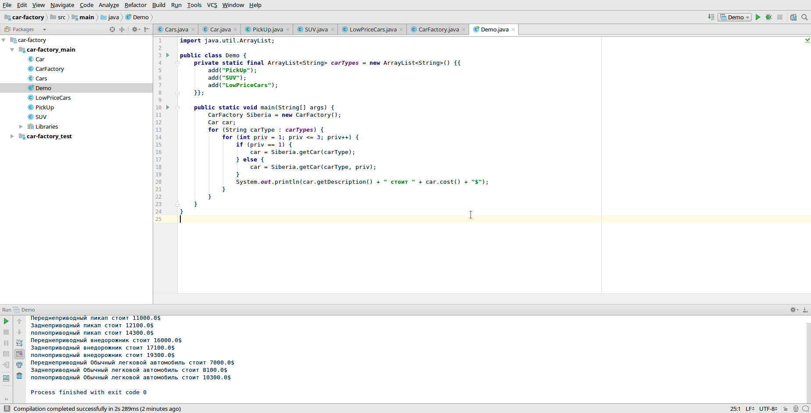

# Задача

```text
В городе Улан-Удэ построили завод по производству автомобилей Siberia. Данный завод производит 3 типа автомобилей: 
1)"пикап"(PickUp)-10000$
2)"внедорожник"(SUV)-15000$
3) Обычный легковой автомобиль(LowPriceCars)-6000$,
также стоимость автомобиля зависит от типа привода:
1) Переднеприводный(стандартный для всех автомобилей, стоимость-1000$)
2)Заднеприводный (стоимость-2100$)
3)полноприводный (стоимость-4300$)
Вам дан класс Cars, где:
1)description-переменная содержащая описание автомобиля.
2)priv-переменная содержащая тип привода автомобиля(1-стандартный,2-заднеприводный,3-полноприводный).
3)getDescription()-функция возвращающая описание автомобиля.
4)cost()-функция возвращающая стоимость автомобиля.
Задача: написать программу по производству стандартных автомобилей. 
```

# Скриншоты

<kbd></kbd>
