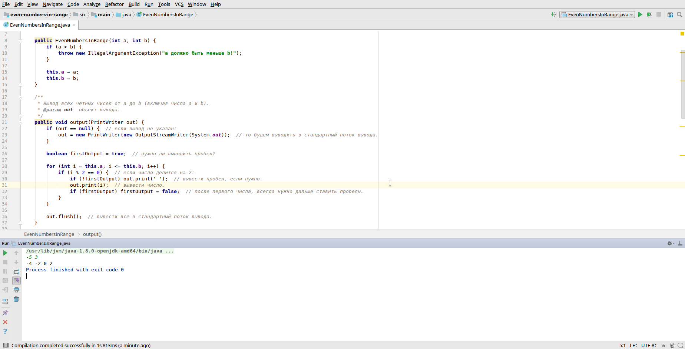

# Задача

Решить задачу, вывод должен быть реализован согласно примеру выходных данных.

Дано два целых числа a, b (a < b).

Вывести все чётные числа от а до b (включая числа a и b).

Пример входных данных:

```text
-5 3
```

Пример выходных данных:

```text
-4 -2 0 2
```

# Скриншот

<kbd></kbd>
