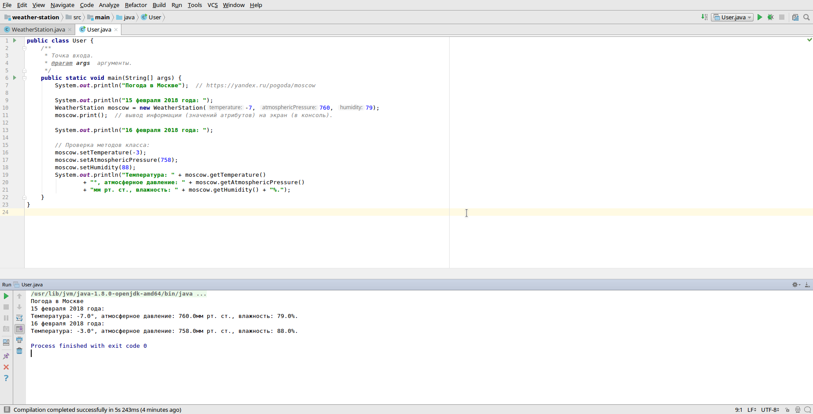

# Задача

Создайте класс согласно задаче, 

определите конструктор (в конструкторе должны задаваться атрибуты класса), 

создайте отдельный класс пользователь с точкой входа, 

проверьте все методы класса.

Создайте класс погодная станция. 

Класс должен содержать атрибуты: 
- температура, 
- влажность, 
- давление (все атрибуты — числа) 

и методы для их изменения. 

Класс также должен содержать метод, который выводит информацию (значения атрибутов) на экран (в консоль).

# Скриншот

<kbd></kbd>
